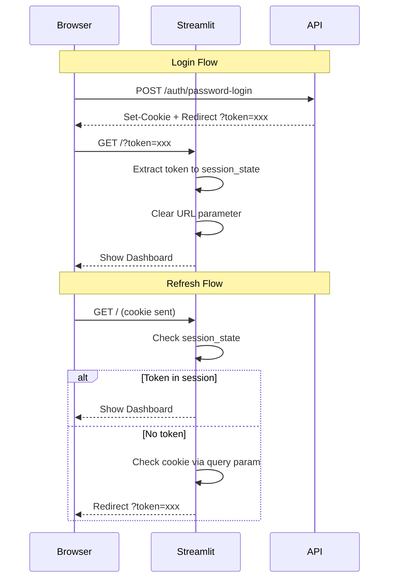

# Authentication Setup

This guide covers authentication methods for ansible-inspec server.

## Overview

ansible-inspec server supports two authentication methods:
- **Azure AD OAuth2**: Enterprise SSO for organization-wide access
- **Local User Authentication**: Username/password for standalone deployments

Both methods provide:
- 7-day JWT token expiry for extended sessions
- Automatic session persistence across browser refreshes
- Secure token storage with HTTP-only cookies
- Query parameter-based session restoration

## Prerequisites

- ansible-inspec server v0.4.0+
- For Azure AD: Azure AD tenant and administrator access
- For local auth: PostgreSQL database configured

## Azure AD App Registration

### 1. Register Application

1. Go to [Azure Portal](https://portal.azure.com)
2. Navigate to **Azure Active Directory** > **App registrations**
3. Click **New registration**
4. Configure:
   - **Name**: `ansible-inspec-server`
   - **Supported account types**: 
     - Single tenant (recommended for organization-only access)
     - Multi-tenant (for cross-organization access)
   - **Redirect URI**: 
     - Platform: `Single-page application`
     - URI: `http://localhost:8081/auth/callback` (development)
     - URI: `https://your-domain.com/auth/callback` (production)

### 2. Configure API Permissions

1. Go to **API permissions**
2. Click **Add a permission**
3. Select **Microsoft Graph**
4. Add **Delegated permissions**:
   - `openid` - Sign users in
   - `profile` - View users' basic profile
   - `email` - View users' email address
   - `User.Read` - Sign in and read user profile
5. Click **Grant admin consent** (requires admin)

### 3. Configure Token Settings

1. Go to **Token configuration**
2. Add optional claims:
   - **ID token**: `email`, `preferred_username`
   - **Access token**: `email`, `preferred_username`
3. For role-based access, add **groups** claim (optional)

### 4. Create Client Secret

1. Go to **Certificates & secrets**
2. Click **New client secret**
3. Description: `ansible-inspec-production`
4. Expires: Choose appropriate duration (12-24 months recommended)
5. Click **Add**
6. **IMPORTANT**: Copy the secret value immediately (shown only once)

### 5. Note Configuration Values

From the **Overview** page, copy:
- **Application (client) ID**: `AZURE_CLIENT_ID`
- **Directory (tenant) ID**: `AZURE_TENANT_ID`
- **Client secret value**: `AZURE_CLIENT_SECRET` (from step 4)

## Server Configuration

### Environment Variables

Create or update `.env` file:

```bash
# Enable authentication
AUTH__ENABLED=true

# Azure AD OAuth2
AUTH__AZURE_TENANT_ID=your-tenant-id-here
AUTH__AZURE_CLIENT_ID=your-client-id-here
AUTH__AZURE_CLIENT_SECRET=your-client-secret-here

# OAuth2 redirect URI (must match Azure AD configuration)
AUTH__OAUTH_REDIRECT_URI=http://localhost:8081/auth/callback

# JWT settings for session management
AUTH__JWT_SECRET=your-random-secret-key-here
AUTH__JWT_ALGORITHM=HS256
AUTH__ACCESS_TOKEN_EXPIRE_MINUTES=30
AUTH__REFRESH_TOKEN_EXPIRE_DAYS=7
```

### Generate JWT Secret

```bash
python -c "import secrets; print(secrets.token_urlsafe(32))"
```

## Testing Authentication

### 1. Start Server

```bash
python -m uvicorn ansible_inspec.server.api:app --reload --port 8080
```

### 2. Test OAuth2 Flow

Navigate to `http://localhost:8081` in your browser. You should be redirected to Azure AD login.

### 3. Test API with Token

```bash
# Get token from Azure AD (use browser flow)
TOKEN="your-access-token"

# Test API endpoint
curl -H "Authorization: Bearer $TOKEN" \
  http://localhost:8080/api/v1/job_templates/
```

## Role-Based Access Control (RBAC)

### User Roles

ansible-inspec supports three roles:

- **admin**: Full access (create, read, update, delete)
- **operator**: Execute jobs, create templates
- **viewer**: Read-only access

### Configure Roles in Azure AD

1. Go to **App registrations** > Your app > **App roles**
2. Create app roles:
   ```json
   {
     "allowedMemberTypes": ["User"],
     "description": "Full administrative access",
     "displayName": "Administrator",
     "id": "generate-unique-guid",
     "isEnabled": true,
     "value": "admin"
   }
   ```
3. Repeat for `operator` and `viewer` roles
4. Assign users to roles in **Enterprise applications** > Your app > **Users and groups**

### Enforce Role in Code

Roles are automatically extracted from token claims and enforced by API endpoints.

## Production Deployment

### HTTPS Required

Azure AD requires HTTPS for production redirect URIs:

1. Update redirect URI in Azure AD to `https://your-domain.com/auth/callback`
2. Update `.env`: `AUTH__OAUTH_REDIRECT_URI=https://your-domain.com/auth/callback`
3. Configure reverse proxy (nginx/Apache) with SSL certificate

### Multi-Tenant Setup

For multi-tenant (cross-organization) access:

1. Change account type to **Multitenant**
2. Update authority URL to use `common` endpoint
3. Implement tenant validation in code (if needed)

## Troubleshooting

### Error: "AADSTS50011: Reply URL mismatch"

- Ensure redirect URI in `.env` exactly matches Azure AD configuration
- Check for trailing slashes
- Verify HTTPS vs HTTP

### Error: "Invalid token"

- Check token expiration
- Verify `AZURE_CLIENT_ID` matches the audience claim
- Ensure token was issued by correct tenant

### Error: "Insufficient permissions"

- Grant admin consent for API permissions
- Check user has assigned role
- Verify role claim is included in token

## Security Best Practices

1. **Token Management**
   - Tokens expire after 7 days for security balance
   - Sessions automatically restore from secure cookies or URL tokens
   - Users can logout manually to invalidate tokens immediately

2. **Secret Rotation**
   - Rotate Azure client secrets regularly (every 3-6 months)
   - Update JWT secret key periodically
   - Use strong, randomly-generated secrets

3. **Secure Storage**
   - Secrets stored in environment variables (never in git)
   - Use Azure Key Vault for production
   - HTTP-only cookies prevent XSS attacks

4. **Access Control**
   - Enable MFA for all administrative users
   - Use role-based access control (RBAC)
   - Monitor authentication logs in Azure AD

5. **Network Security**
   - Use HTTPS in production
   - Configure secure cookie settings
   - Set SameSite cookie attribute to prevent CSRF

## Session Persistence

The server implements a multi-layered session persistence strategy:

### Token Storage Methods

1. **Browser Session State** (Primary)
   - Tokens stored in Streamlit session_state during active use
   - Persists across page navigation within session
   - Cleared when browser tab closes

2. **HTTP Cookies** (Backup)
   - 7-day expiry aligns with token lifetime
   - HTTP-only prevents JavaScript access
   - Secure flag in production (HTTPS only)
   - SameSite=lax prevents CSRF attacks

3. **URL Query Parameters** (Restore)
   - Token passed as `?token=xxx` after login
   - Automatically extracted on page load
   - Cleared from URL after extraction for security
   - Enables session restoration after refresh

### Session Flow



### Configuration

```bash
# .env file
AUTH__ACCESS_TOKEN_EXPIRE_MINUTES=10080  # 7 days
AUTH__COOKIE_NAME=ansible_inspec_token
AUTH__COOKIE_HTTPONLY=false  # Allow JS read for Streamlit
AUTH__COOKIE_SECURE=true     # HTTPS only in production
AUTH__COOKIE_SAMESITE=lax    # CSRF protection
```

## Local User Authentication

### Creating Users

Users are created via the API or database initialization:

```bash
# Via API (requires admin token)
curl -X POST http://localhost:8080/api/v1/users \
  -H "Authorization: Bearer $ADMIN_TOKEN" \
  -H "Content-Type: application/json" \
  -d '{
    "username": "john.doe",
    "email": "john@example.com",
    "name": "John Doe",
    "password": "secure-password",
    "roles": ["user"]
  }'
```

### Default Admin Account

The server creates a default admin account on first run:
- Username: `admin`
- Password: Set via `DEFAULT_ADMIN_PASSWORD` environment variable
- Roles: `["admin"]`

**Important**: Change the default password immediately in production!

### Password Requirements

- Minimum 8 characters
- Bcrypt hashing with salt
- Stored securely in PostgreSQL
- Password reset requires admin intervention (API call)

## Azure AD OAuth2 Setup

## References

- [Microsoft Identity Platform Documentation](https://docs.microsoft.com/en-us/azure/active-directory/develop/)
- [Azure AD OAuth 2.0 Flow](https://docs.microsoft.com/en-us/azure/active-directory/develop/v2-oauth2-auth-code-flow)
