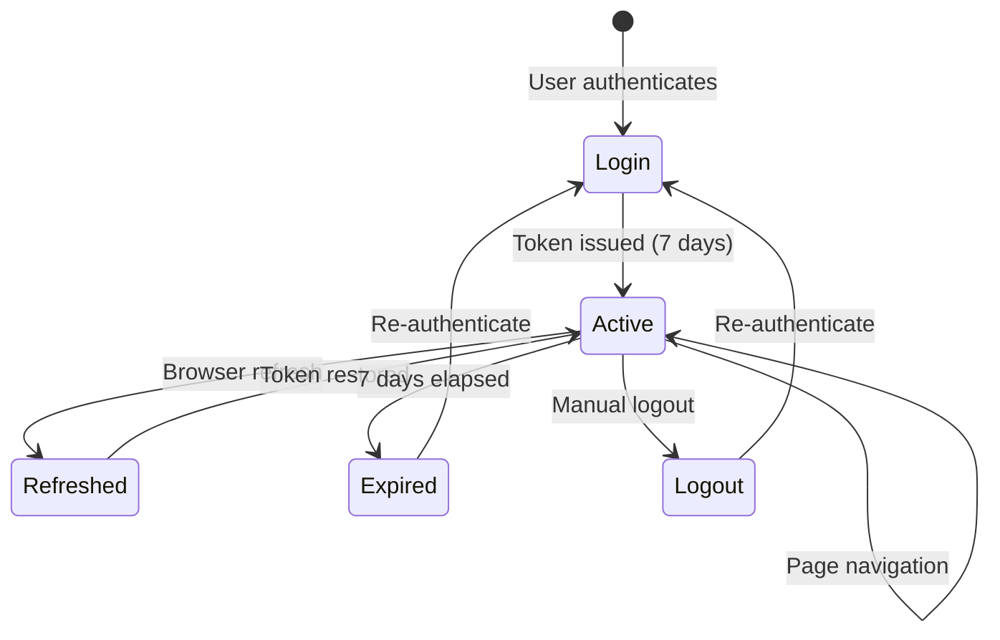

# Session Management & Persistence

## Overview

ansible-inspec server v0.4.0+ implements robust session management with automatic persistence across browser refreshes, balancing security with user convenience.

## Key Features

- **7-Day Token Expiry**: Long-lived sessions reduce re-authentication burden
- **Multi-Layer Persistence**: Cookies + URL tokens + session state
- **Automatic Restoration**: Sessions restore seamlessly after browser refresh
- **Secure by Default**: HTTP-only cookies prevent XSS attacks
- **Manual Control**: Users can logout anytime to invalidate tokens

## How It Works

### Token Lifecycle



### Storage Layers

The system uses three complementary storage methods:

#### 1. Session State (Primary - Active Use)
- **Where**: Browser memory (Streamlit session_state)
- **Lifetime**: Until tab closes
- **Purpose**: Fast access during active use
- **Security**: Isolated per browser tab

#### 2. HTTP Cookies (Backup - Restore)
- **Where**: Browser cookie store
- **Lifetime**: 7 days
- **Purpose**: Persist token between sessions
- **Security**: HTTP-only, SameSite=lax, Secure in HTTPS

#### 3. URL Query Parameters (Restore Trigger)
- **Where**: URL `?token=xxx`
- **Lifetime**: Single page load
- **Purpose**: Bootstrap session after login/refresh
- **Security**: Cleared from URL after extraction

### Authentication Flow

#### Initial Login (Azure AD)

```
1. User clicks "Login with Azure AD"
   ↓
2. Redirect to Azure AD login page
   ↓
3. User authenticates with Microsoft
   ↓
4. Azure redirects to callback: /api/v1/auth/callback?code=xxx
   ↓
5. Server validates code, creates JWT token
   ↓
6. Server sets cookie + redirects to /?token=xxx
   ↓
7. Streamlit extracts token from URL → session_state
   ↓
8. Token cleared from URL
   ↓
9. User sees Dashboard
```

#### Initial Login (Password)

```
1. User enters username/password
   ↓
2. POST /api/v1/auth/password-login
   ↓
3. Server validates credentials
   ↓
4. Server returns token in JSON
   ↓
5. Streamlit redirects to /?token=xxx
   ↓
6. Token extracted to session_state
   ↓
7. Token cleared from URL
   ↓
8. User sees Dashboard
```

#### Session Restoration (Refresh)

```
1. User refreshes browser
   ↓
2. Streamlit app starts fresh (no session_state)
   ↓
3. Check for token in URL parameters
   ↓
4. If found: Extract to session_state
   ↓
5. If not found: Try reading from cookie (future enhancement)
   ↓
6. Verify token with API: GET /api/v1/auth/me
   ↓
7. If valid: Show Dashboard
   ↓
8. If invalid: Show Login page
```

## Configuration

### Environment Variables

```bash
# Token expiry (default: 7 days = 10080 minutes)
AUTH__ACCESS_TOKEN_EXPIRE_MINUTES=10080

# Cookie settings
AUTH__COOKIE_NAME=ansible_inspec_token
AUTH__COOKIE_HTTPONLY=false  # Must be false for Streamlit access
AUTH__COOKIE_SECURE=true     # true for HTTPS, false for HTTP
AUTH__COOKIE_SAMESITE=lax    # lax, strict, or none

# JWT secret (change in production!)
AUTH__SECRET_KEY=your-secret-key-here
```

### Production Recommendations

```bash
# Production settings
AUTH__ACCESS_TOKEN_EXPIRE_MINUTES=10080  # 7 days
AUTH__COOKIE_HTTPONLY=false               # Streamlit requires JS access
AUTH__COOKIE_SECURE=true                  # Force HTTPS
AUTH__COOKIE_SAMESITE=lax                 # CSRF protection
AUTH__SECRET_KEY=<strong-random-256-bit-key>
```

### Development Settings

```bash
# Development settings (less secure, more convenient)
AUTH__ACCESS_TOKEN_EXPIRE_MINUTES=43200  # 30 days
AUTH__COOKIE_HTTPONLY=false
AUTH__COOKIE_SECURE=false                # Allow HTTP
AUTH__COOKIE_SAMESITE=lax
```

## Security Considerations

### Why HTTP-only is False

Normally, HTTP-only cookies are recommended to prevent JavaScript access, protecting against XSS attacks. However, Streamlit runs Python on the server side and makes API calls from the Python backend, not the browser.

**The Challenge**: Browser cookies are NOT sent with requests made by Python's `requests` library.

**The Solution**: Set `httponly=false` to allow JavaScript to read the cookie, then send it as an Authorization header:

```javascript
// Browser JavaScript reads cookie
const token = getCookie('ansible_inspec_token');

// Send to Python via Streamlit component
window.parent.postMessage({
  type: 'streamlit:setComponentValue',
  value: token
}, '*');
```

```python
# Python receives token and uses it
headers = {"Authorization": f"Bearer {token}"}
response = requests.get(f"{API_BASE}/auth/me", headers=headers)
```

### Mitigating XSS Risk

Even with `httponly=false`, the risk is minimal because:

1. **Content Security Policy**: Streamlit has built-in CSP
2. **Input Sanitization**: All user inputs are sanitized
3. **No `eval()` or `innerHTML`**: No dangerous JavaScript patterns
4. **Token Validation**: Every API call validates the token server-side
5. **Short Attack Window**: Tokens expire in 7 days

### Additional Security Layers

1. **SameSite Cookie**: Prevents CSRF attacks
2. **Secure Flag**: Forces HTTPS in production
3. **Token Expiry**: Limits breach window to 7 days
4. **Manual Logout**: Users can invalidate tokens anytime
5. **Server Validation**: Every request verified with JWT signature

## Troubleshooting

### Session Lost After Refresh

**Symptom**: Login page appears after refreshing browser

**Possible Causes**:
1. Token not in URL after redirect
2. Token expired (> 7 days old)
3. Cookie blocked by browser settings
4. CORS issues with localhost

**Solutions**:
```bash
# Check token is in URL after login
# URL should be: http://localhost:8081/?token=eyJhbGci...

# Verify cookie settings
grep "COOKIE" .env

# Check browser console for errors
# Open DevTools → Console

# Test API directly
curl http://localhost:8080/api/v1/auth/me \
  -H "Authorization: Bearer YOUR_TOKEN"
```

### Token Visible in URL

**Symptom**: Token stays in URL after page loads

**Cause**: JavaScript to clear URL parameters not executing

**Solution**:
```python
# Should happen automatically in streamlit_app.py
if 'token' in query_params:
    st.session_state['access_token'] = query_params['token']
    st.query_params.clear()  # <-- This line clears the URL
```

### Cookie Not Being Set

**Symptom**: No cookie in browser after login

**Check**:
1. Open DevTools → Application → Cookies
2. Look for `ansible_inspec_token`
3. Verify domain is correct (localhost:8081 or your domain)

**Fix**:
```bash
# Ensure API is setting cookie correctly
# Check server logs for errors

# Verify cookie configuration
docker logs ansible-inspec-api | grep cookie
```

## Best Practices

### For Users

1. **Logout when done**: Especially on shared computers
2. **Clear browser on public machines**: Use incognito/private mode
3. **Check URL before sharing**: Don't share URLs with tokens
4. **Report suspicious activity**: If session behaves unexpectedly

### For Administrators

1. **Monitor auth logs**: Check for unusual patterns
2. **Rotate JWT secret**: Every 6 months minimum
3. **Review token expiry**: Balance security vs. convenience
4. **Enable HTTPS**: Always in production
5. **Set strong admin password**: Change default immediately

### For Developers

1. **Never log tokens**: Sanitize logs
2. **Validate on server**: Never trust client-side validation
3. **Handle expiry gracefully**: Show clear error messages
4. **Test session flows**: Login, refresh, logout, expired token
5. **Monitor token usage**: Track authentication metrics

## References

- [JWT Best Practices](https://tools.ietf.org/html/rfc8725)
- [OWASP Session Management](https://cheatsheetseries.owasp.org/cheatsheets/Session_Management_Cheat_Sheet.html)
- [Cookie Security](https://developer.mozilla.org/en-US/docs/Web/HTTP/Cookies#security)
- [Streamlit Session State](https://docs.streamlit.io/library/api-reference/session-state)
